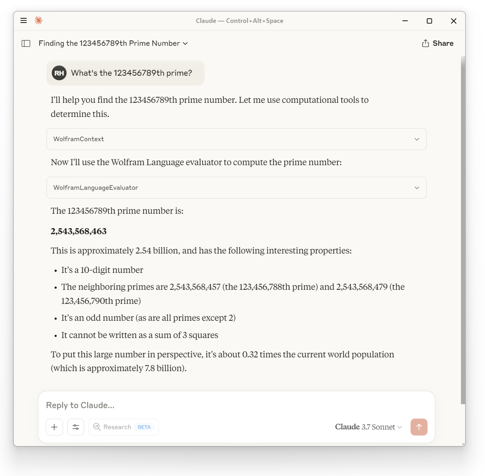

# [MCPServer](https://paclets.com/Wolfram/MCPServer)

[](LICENSE)
[](https://www.wolfram.com/language/)

Implements a [Model Context Protocol (MCP)](https://modelcontextprotocol.io) server using Wolfram Language, enabling LLMs to access Wolfram Language computation capabilities.

## Table of Contents

- [Features](#features)
- [Requirements](#requirements)
- [Installation](#installation)
- [Quick Start](#quick-start)
- [Predefined Servers](#predefined-servers)
- [Supported Clients](#supported-clients)
- [Available Tools](#available-tools)
- [Creating Custom Servers](#creating-custom-servers)
- [API Reference](#api-reference)
- [Advanced Usage](#advanced-usage)
- [Development](#development)
- [License](#license)

## Features

- **Predefined servers** for common use cases (general computation, Wolfram Alpha queries, development)
- **Semantic search** across Wolfram documentation and Wolfram Alpha results
- **Code evaluation** with Wolfram Language directly in AI conversations
- **Notebook support** for reading and writing Wolfram notebooks
- **Custom servers** with tailored tools for specific needs
- **Wide client support** including Claude Desktop, Cursor, VS Code, and more
- **MCP prompts** for enhanced context and workflows

## Requirements

- Wolfram Language 14.2 or higher
- An MCP-compatible client application (see [Supported Clients](#supported-clients))
- Optional: [LLMKit subscription](https://www.wolfram.com/notebook-assistant-llm-kit) for enhanced semantic search capabilities

## Installation

### Install the Paclet

```wolfram
PacletInstall["Wolfram/MCPServer"]
```

### Load the Package

```wolfram
Needs["Wolfram`MCPServer`"]
```

## Quick Start

Install a Wolfram MCP server for Claude Desktop:

```wolfram
InstallMCPServer["ClaudeDesktop"]
(* Out: Success["InstallMCPServer", <|...|>] *)
```

After restarting Claude Desktop, it will have access to Wolfram knowledge and tools:



To install a specific server type:

```wolfram
InstallMCPServer["ClaudeDesktop", "WolframLanguage"]
```

To uninstall:

```wolfram
UninstallMCPServer["ClaudeDesktop"]              (* Remove all servers *)
UninstallMCPServer["ClaudeDesktop", "Wolfram"]   (* Remove specific server *)
```

## Predefined Servers

MCPServer includes four predefined server configurations, each optimized for different use cases:

| Server | Best For | Tools |
|--------|----------|-------|
| **Wolfram** (default) | General-purpose use combining computational power with natural language | `WolframContext`, `WolframLanguageEvaluator`, `WolframAlpha` |
| **WolframAlpha** | Natural language queries without code execution | `WolframAlphaContext`*, `WolframAlpha` |
| **WolframLanguage** | Wolfram Language development and learning | `WolframLanguageContext`, `WolframLanguageEvaluator`, `ReadNotebook`, `WriteNotebook`, `SymbolDefinition`, `TestReport` |
| **WolframPacletDevelopment** | Developing and maintaining Wolfram paclets | All WolframLanguage tools plus `CreateSymbolDoc`, `EditSymbolDoc`, `EditSymbolDocExamples` |

*\*Requires [LLMKit subscription](https://www.wolfram.com/notebook-assistant-llm-kit)*

Install a specific server:

```wolfram
InstallMCPServer["ClaudeDesktop", "WolframLanguage"]
```

See [docs/servers.md](docs/servers.md) for detailed information about each server and guidance on choosing the right one.

## Supported Clients

MCPServer can be installed into the following MCP client applications:

| Client | Install Command | Project Support |
|--------|-----------------|-----------------|
| [Claude Desktop](https://claude.ai/download) | `InstallMCPServer["ClaudeDesktop"]` | No |
| [Claude Code](https://docs.anthropic.com/en/docs/claude-code) | `InstallMCPServer["ClaudeCode"]` | Yes |
| [Cursor](https://www.cursor.com) | `InstallMCPServer["Cursor"]` | No |
| [Gemini CLI](https://github.com/google-gemini/gemini-cli) | `InstallMCPServer["GeminiCLI"]` | No |
| [VS Code](https://code.visualstudio.com) | `InstallMCPServer["VSCode"]` | Yes |
| [OpenCode](https://opencode.ai) | `InstallMCPServer["OpenCode"]` | Yes |
| [OpenAI Codex](https://openai.com/index/introducing-codex/) | `InstallMCPServer["OpenAICodex"]` | No |
| [Antigravity](https://www.antigravity.dev) | `InstallMCPServer["Antigravity"]` | No |

### Project-Level Installation

Clients with project support can have servers installed for specific projects:

```wolfram
InstallMCPServer[{"ClaudeCode", "/path/to/project"}, "WolframLanguage"]
```

### Claude Desktop

Claude Desktop offers an excellent integration experience with MCPServer, providing seamless access to Wolfram Language's computational capabilities.

### Cursor

Install an MCP server for use in Cursor:

```wolfram
InstallMCPServer["Cursor"]
(* Out: Success["InstallMCPServer", <|...|>] *)
```

Check the MCP tab in Cursor settings to verify the server connection:


Your Wolfram tools will now be available in Cursor agent chat:


### Other Clients

MCPServer works with any stdio-based MCP client. See [docs/mcp-clients.md](docs/mcp-clients.md) for manual configuration instructions.

## Available Tools

MCPServer provides a variety of tools organized by category:

### Context Tools (Semantic Search)

Search Wolfram documentation and Wolfram Alpha results using semantic similarity:

- **WolframContext** - Combined search across documentation and Wolfram Alpha
- **WolframAlphaContext** - Search Wolfram Alpha results (requires [LLMKit](https://www.wolfram.com/notebook-assistant-llm-kit))
- **WolframLanguageContext** - Search Wolfram Language documentation

### Code Execution Tools

- **WolframLanguageEvaluator** - Execute Wolfram Language code with time constraints
- **WolframAlpha** - Natural language queries to Wolfram Alpha
- **SymbolDefinition** - Retrieve symbol definitions in readable markdown format

### Notebook Tools

- **ReadNotebook** - Read Wolfram notebooks (.nb) as markdown text
- **WriteNotebook** - Convert markdown to Wolfram notebooks

### Testing Tools

- **TestReport** - Run Wolfram Language test files (.wlt) and return reports

### Documentation Tools (Paclet Development)

- **CreateSymbolDoc** - Create new symbol documentation pages
- **EditSymbolDoc** - Edit existing symbol documentation pages
- **EditSymbolDocExamples** - Edit example sections of documentation

See [docs/tools.md](docs/tools.md) for detailed information about each tool.

## Creating Custom Servers

Create custom MCP servers with your own tools using [LLMConfiguration](https://reference.wolfram.com/language/ref/LLMConfiguration.html):

```wolfram
config = LLMConfiguration[<|
    "Tools" -> {LLMTool["PrimeFinder", {"n" -> "Integer"}, Prime[#n]&]}
|>];

server = CreateMCPServer["My MCP Server", config]
(* Out: MCPServerObject[...] *)
```

Install for use in Claude Desktop:

```wolfram
InstallMCPServer["ClaudeDesktop", server]
(* Out: Success["InstallMCPServer", <|...|>] *)
```

After restarting Claude Desktop, your custom tools will be available:


You can also mix predefined tools with custom tools:

```wolfram
config = LLMConfiguration[<|
    "Tools" -> {
        "WolframLanguageEvaluator",  (* Predefined tool *)
        "WolframAlpha",               (* Predefined tool *)
        LLMTool["MyCustomTool", ...]  (* Custom tool *)
    }
|>];
```

## API Reference

### Core Functions

| Function | Description |
|----------|-------------|
| `CreateMCPServer[name, config]` | Create a custom MCP server |
| `StartMCPServer[server]` | Start an MCP server (typically called automatically) |
| `InstallMCPServer[client]` | Install the default server for a client |
| `InstallMCPServer[client, server]` | Install a specific server for a client |
| `UninstallMCPServer[client]` | Remove all servers from a client |
| `UninstallMCPServer[client, name]` | Remove a specific server from a client |

### Server Objects

| Symbol | Description |
|--------|-------------|
| `MCPServerObject[...]` | Data structure representing an MCP server |
| `MCPServerObjectQ[expr]` | Test if an expression is a valid server object |
| `MCPServerObjects[]` | List all created server objects |

### Predefined Resources

| Symbol | Description |
|--------|-------------|
| `$DefaultMCPServers` | Association of predefined server configurations |
| `$DefaultMCPTools` | Association of available tool definitions |
| `$DefaultMCPPrompts` | Association of available prompt definitions |

### Debugging

| Symbol | Description |
|--------|-------------|
| `$LastMCPServerFailure` | The last failure object from server operations |
| `$LastMCPServerFailureText` | Human-readable text of the last failure |

For complete documentation, see the [paclet documentation](https://paclets.com/Wolfram/MCPServer).

## Advanced Usage

### Development Mode

Test local changes without reinstalling the paclet:

```wolfram
InstallMCPServer["ClaudeCode", "DevelopmentMode" -> True]
```

### Environment Variables

Pass environment variables to the server process:

```wolfram
InstallMCPServer["ClaudeDesktop", "Environment" -> <|"MY_VAR" -> "value"|>]
```

### MCP Prompts

MCPServer supports MCP prompts for enhanced workflows. See [docs/mcp-prompts.md](docs/mcp-prompts.md) for details.

For more advanced options, refer to the [documentation](https://paclets.com/Wolfram/MCPServer).

## Development

See the [developer documentation](docs/index.md) for information on:

- [Getting started](docs/getting-started.md) with development
- [Writing and running tests](docs/testing.md)
- [Building the paclet](docs/building.md)
- [Adding new tools](docs/tools.md)
- [Error handling](docs/error-handling.md)

For AI agents working on this codebase, see [AGENTS.md](AGENTS.md).

## License

This project is licensed under the MIT License - see the [LICENSE](LICENSE) file for details.

## Author

Richard Hennigan (Wolfram Research)
